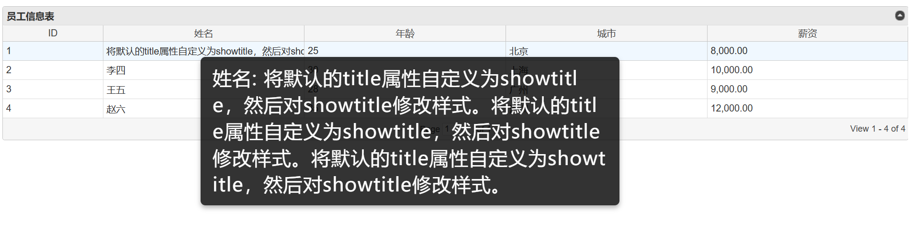

# jqGrid 表格展示系统

# Hi there 👋, I'm 牛经理!

🌟 **大龄程序员** | 🛠️ **代码老司机** | 🚀 **技术探索者** | 🌱 **持续学习中** 

## 项目说明
这是一个基于 jQuery jqGrid 插件实现的表格展示系统，特别优化了悬浮提示功能，提供清晰美观的数据预览体验。

## 效果演示

### 悬浮提示效果

## 核心功能：悬浮提示（Tooltip）
### 设计特点
- **大字体显示**：采用24px字体大小，确保信息清晰可读
- **智能换行**：自动处理长文本，支持中英文混排自动换行
- **半透明背景**：使用rgba(0, 0, 0, 0.8)实现柔和的视觉效果
- **动画过渡**：平滑的淡入淡出效果（200ms）
- **自适应定位**：智能避免超出屏幕边界
- **统一字体**：使用微软雅黑确保中文显示清晰

### 交互体验
- 鼠标悬停即时响应
- 跟随鼠标移动的实时提示
- **圆角边框和阴影效果增强视觉层次**
- 适当的内边距（10px 15px）确保内容不会过于拥挤

### 技术实现
- 基于jQuery UI tooltip组件深度定制
- 支持HTML内容渲染
- 响应式宽度调整（160px - 500px）
- 针对不同设备的显示优化

## 其他功能
1. 表格展示
   - 自适应宽度
   - 分页功能
   - 排序功能
   - 响应式布局

2. 样式定制
   - 表格行悬浮效果
   - 自定义字体大小
   - 统一的中文字体支持

## 技术栈
- jQuery
- jqGrid
- jQuery UI (tooltip)

如果这个仓库对你有帮助，欢迎 star，欢迎提问。如果这个仓库帮你解决了问题，可以请即将失业的大龄程序员的我喝杯奶茶：

